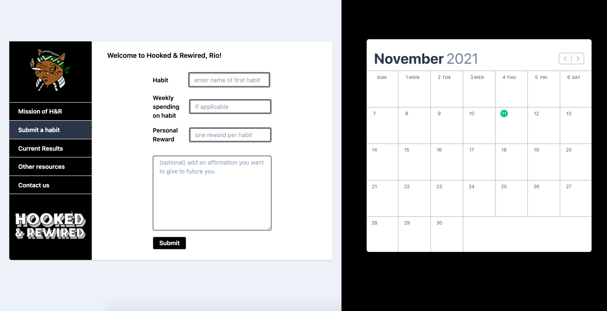

## Notes
_This app will be ready to launch in December._

## Description
Hooked & Rewired is a fullstack app designed to help people who are trying to break bad habits. It takes 21 days to break a bad habit. This app isn't designed to make it easier, it's designed to make you better. 

## Features
Users will be able to log in and sign up for a free account. The app has three main functions: 

`1. The Habit Tracker` a streak calendar to track one or multiple vices and to visually see the amount of days they have not engaged with these vices - the streaks can also be broken, 

`2. A Rewards tool` where people can customize what kind of reward they'd like to give themselves. The system gives them the option to reward themselves after every streak is created, 

`3. A Reinforcement tool` If users are substituting a vice for exercise, the app will use a maps API to track/log the distance. The intake survery a user has to fill out before engaging with the app involces filling out a section about how much their habit costs them on a weekly basis (if monetary + applicable). The reinforcement tool breaks down that costs, and with every streak created, a user gets to see how much money they theoritically have saved during those days.

## How it's made
> Made using CSS, Javascript, Node.js, APIs, JSON, Express, EJS, MongoDB, mongoose, Multer, and User Authentification using passport.

