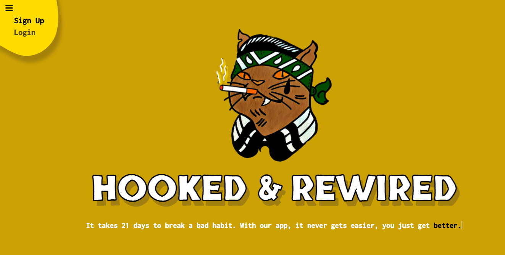

## Notes
_This app will be ready to launch in December._

## Description
Hooked & Rewired is a fullstack app designed to help people who are trying to break bad habits. It takes 21 days to break a bad habit. This app isn't designed to make it easier, it's designed to make you better. 

## Features
Users will be able to log in and sign up for a free account. When they create an account, they will fill out an intake survey that inputs their habits, their rewards, and how much money this habit costs them on a weekly basis (if applicable).   

The app has four main functions: 

1. `The Habit Tracker`  A streak calendar to track one or multiple vices and to visually see the amount of days they have not engaged with these vices, 

2. `A Rewards tool`  Where people can customize what kind of reward they'd like to give themselves. The system gives them the option to reward themselves after every streak is created, 

3. `A Reinforcement tool`  If users are substituting a vice for exercise, the app will use a maps API to track/log the distance. In addition to seeing how much money the user has theoretically saved up during their streaks, they'll also literally see how far they've gone too,

4. `Enhanced Accountability`  Where users can share their habit tracker calendar with friends, thus adding pressure, accountability, and access to the progress of each habit. ___They also have the option to sign up for text message alerts.**___

## How it's made
> Made using CSS, Javascript, Node.js, APIs, JSON, Express, EJS, Sass, MongoDB, mongoose, Multer, and User Authentification using passport.

